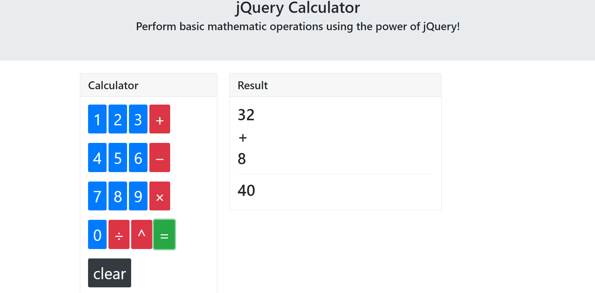

# A Basic Calculator, using JQuery
A very basic calculator for adding up two numbers. Quick and fun project to familiarize myself with JQuery better.
[Use the Calculator Here!](https://madeleinegriggs.github.io/jquery-basic-calculator/index.html)

## Author
Madeleine Griggs, original layout and design by UofT coding bootcamp.

## About this Project
this is a calculator which does basic math operations for two numbers. It was written as a small group class activity with the UofT coding bootcamp. 

## Information about the Theme
All the styling in this project is from Bootstrap. [Go to Bootstrap Website](https://getbootstrap.com/)

### Screenshots

